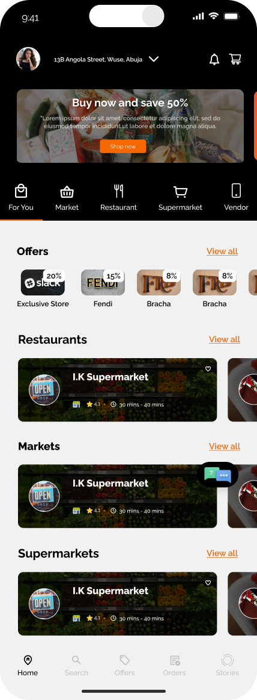
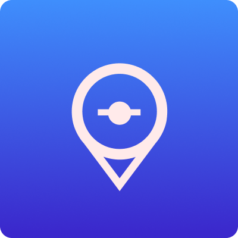
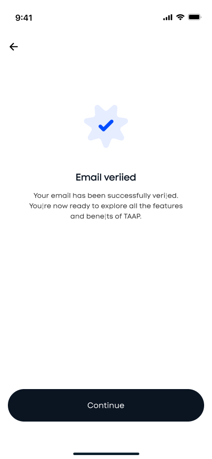

# About adepauldami

# Hi, I'm Adeyemi Paul Damilola, but you can call me Paul. I'm a full-time software developer from Nigeria, and I have a passion for creating cool things using code. 

### [Adeyemi Paul Damilola](https://github.com/adepauldami/about-ade-paul-dami)    
   

# Here's a little about me and what I have built and what I love to do.

## What I have built:

### Binnox Apps
#### (Rider app, User app and Business app)  
#### [Binnox](https://play.google.com/store/apps/details?id=com.app.binnox)     
   
   
   
   
      

#### [Binnox Rider](https://play.google.com/store/apps/details?id=com.binnox.rider)     
   
   
   
   
   
   

#### [Binnox Business](https://play.google.com/store/apps/details?id=com.binnox.business)     
   
   
   
   
   

### Carbs Apps
#### (Rider app and User app)  
(yet to be released)
#### [Carbs Rider](/imgs/carb_rider.png)     
     
#### [Carbs Driver](/imgs/carb_driver.png)     
     

### Just U App
(yet to be released)  
#### [Just U](/imgs/just_u.png)  
  > 
  > 
  

### TAAP App
(yet to be released)  
#### [TAAP](/imgs/just_u.png)  
   
   
  

### Blue Data App
(yet to be released)  

## What I love doing:

#### 1. Flutter and Dart Development: 
I specialize in Flutter and Dart, which means I build cross-platform mobile applications that work seamlessly on both Android and iOS devices. I enjoy using Flutter's rich widgets to create beautiful, responsive user interfaces. Dart's flexibility allows me to design robust data models and implement complex business logic, so my apps not only look good but also work flawlessly.

#### 2. Backend Development with Appwrite: 
On the backend side, I use Appwrite, which gives me essential features like authentication, databases, storage, and real-time communication. This setup allows me to focus on building the frontend without worrying about the complexities of setting up a full backend infrastructure from scratch.

#### 3. Graphics and Branding: 
I also have a knack for graphics and branding. I create eye-catching graphics for my app interfaces and branding materials. I know how important it is for projects to have a consistent and appealing visual identity, so I put a lot of effort into creating a cohesive look.

#### 4. Cybersecurity and Certified Hacking: 
I'm a certified hacker with some experience in cybersecurity. This background gives me a security-first approach to building software. I ensure that my applications are secure and follow best practices to protect against vulnerabilities and attacks. It's essential to me that the code I write is not only functional but also safe.

#### 5. Additional Technical Skills: 
I also have experience with Node.js and PHP for backend development. These skills help me switch between different technologies depending on project requirements. I have a basic understanding of large language models (LLMs), which I've explored out of curiosity for AI and machine learning. With Docker, I can containerize applications for efficient deployment, and I also have some networking knowledge, which helps me manage network protocols and architecture.

#### 6. Love for Music and Church Media: 
Outside of coding, I have a deep love for music. I play drums and keyboard, and I have experience in sound engineering, which I use to manage and improve audio quality for church events and recordings. I also work with church media, handling streaming and other technical aspects of church services. Whether I'm setting up live streams, managing audio systems, or creating multimedia content, I find joy in using my musical talents to contribute to my community.

#### "Apart from all this, I am a lover of God and I enjoy helping others."

   

